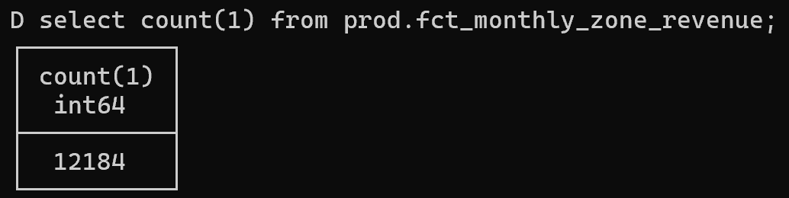
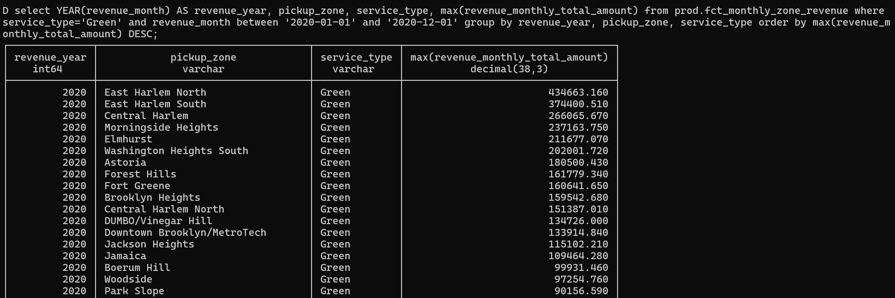
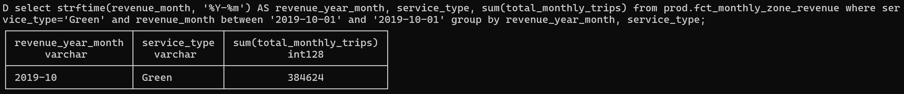
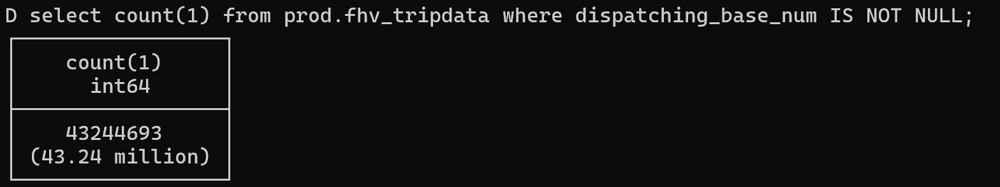

# HOMEWORK WEEK4 - DBT

**Q3: Count of records in fct_monthly_zone_revenue?**

```sql
SELECT COUNT(1) 
FROM `prod.fct_monthly_zone_revenue`; 
```



**Q4: Zone with highest revenue for Green taxis in 2020?**

```sql
SELECT YEAR(revenue_month) AS revenue_year, pickup_zone, 
service_type, 
max(revenue_monthly_total_amount) 
FROM prod.fct_monthly_zone_revenue 
WHERE service_type='Green' 
AND revenue_month BETWEEN '2020-01-01' AND '2020-12-01' 
GROUP BY revenue_year, pickup_zone, service_type 
ORDER BY max(revenue_monthly_total_amount) DESC;
```



**Q5: Total trips for Green taxis in October 2019?**

```sql
SELECT strftime(revenue_month, '%Y-%m') AS revenue_year_month, 
service_type, 
sum(total_monthly_trips) 
FROM prod.fct_monthly_zone_revenue 
WHERE service_type='Green' 
AND revenue_month BETWEEN '2019-10-01' AND '2019-10-01' 
GROUP BY revenue_year_month, service_type;
```



**Q6: Count of records in stg_fhv_tripdata (filter dispatching_base_num IS NULL)?**

```sql
SELECT count(1)
FROM prod.stg_fhv_tripdata 
WHERE dispatching_base_num IS NOT NULL;
```
