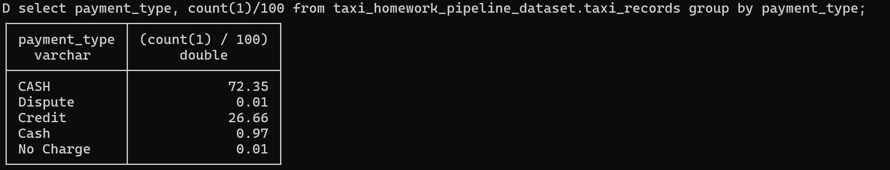
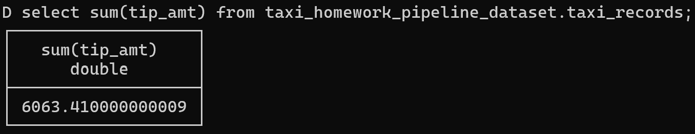

# Workshop 1: Ingestion with dlt for Data Engineering Zoomcamp 2026


**What is the start date and end date of the dataset?**

```sql
SELECT min(trip_pickup_date_time), max(trip_dropoff_date_time) 
FROM taxi_homework_pipeline_dataset._data_engineering_zoomcamp_api; 
```


---

**Question 2. What proportion of trips are paid with credit card?**

```sql
SELECT payment_type, count(1)/100
FROM taxi_homework_pipeline_dataset.taxi_records 
GROUP BY payment_type;
```


---

**Question 3. What is the total amount of money generated in tips?**

```sql
SELECT sum(tip_amt) 
FROM taxi_homework_pipeline_dataset.taxi_records;
```


---
