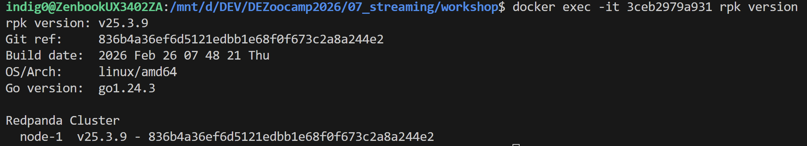
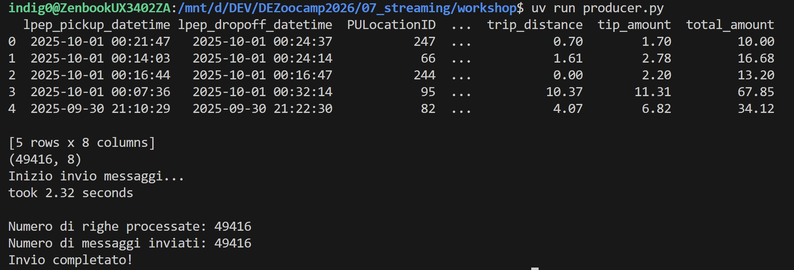
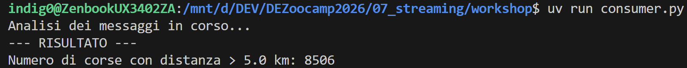
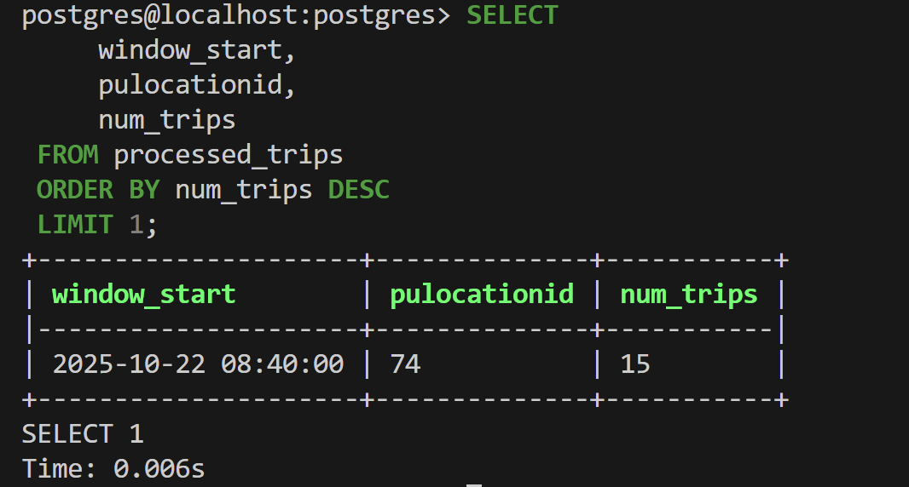
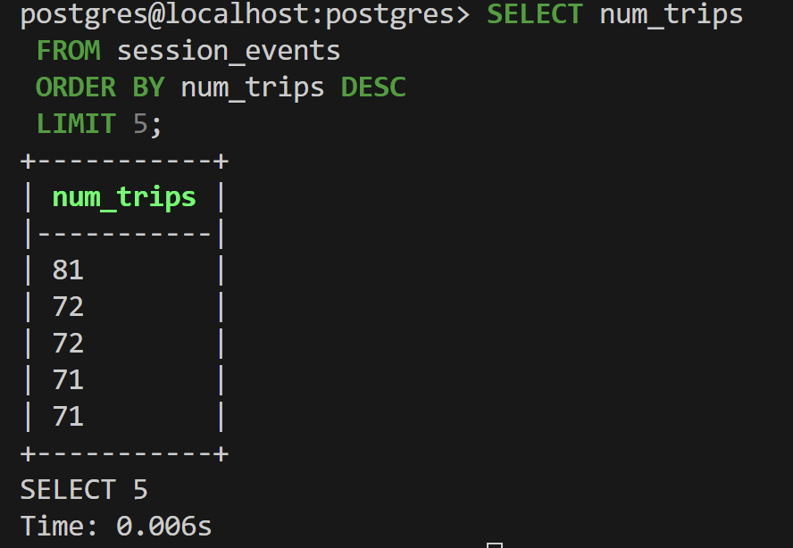
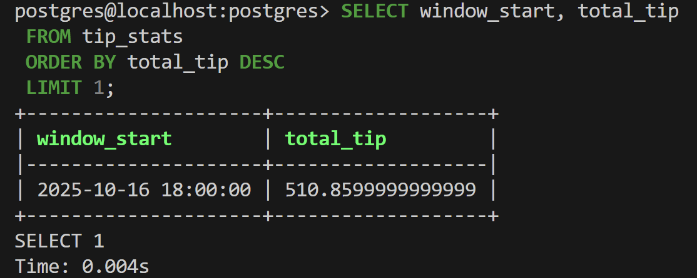

# HOMEWORK WEEK7 - STREAM PROCESSING

**Q1: Question 1. Redpanda version**

```sql
docker exec -it 3ceb2979a931 rpk version
```


---

**Q2: How long did it take to send the data?**

```sql
uv run producer.py
```


---

**Q3: Consumer - trip distance?**

```sql
uv run consumer.py
```


---

**Q4: Which PULocationID had the most trips in a single 5-minute window?**

```sql
SELECT window_start, pulocationid, num_trips
FROM processed_trips 
ORDER BY num_trips DESC
LIMIT 1
```


---

**Q5: Session window - longest streak?**

```sql
SELECT num_trips
FROM session_events
ORDER BY num_trips DESC
LIMIT 5
```


---

**Q6: Session window - longest streak?**

```sql
SELECT window_start, total_tip
FROM tip_stats
ORDER BY total_tip DESC
LIMIT 1
```


---